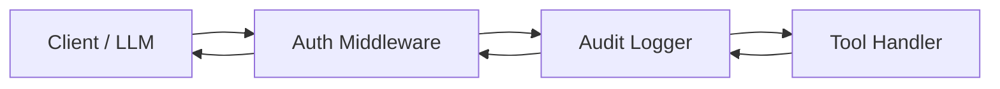

# Middleware & Interceptors

**mcponce** features a full-featured, composable middleware pipeline based on the classic **Onion pattern** (similar to Koa, Express, and Hono). Middleware handlers wrap every tool execution, giving you complete control before and after the handler runs.



---

## The Onion Pipeline

A middleware is a function that receives a `ToolMiddlewareContext` and a `next` function. Calling `await next()` invokes the downstream middleware or the target tool handler:

```typescript
import { createMcpServer } from 'mcponce';

const app = createMcpServer({ name: 'my-server' });

// Global timing middleware
app.use(async (ctx, next) => {
  const start = performance.now();
  console.log(`[START] Executing tool: ${ctx.tool}`);

  try {
    const result = await next();
    const duration = (performance.now() - start).toFixed(2);
    console.log(`[DONE] ${ctx.tool} took ${duration}ms`);
    return result;
  } catch (error) {
    console.error(`[FAIL] ${ctx.tool} threw:`, error);
    throw error;
  }
});
```

---

## Filtering Middleware

You can attach middleware globally, filter by tool names, apply regular expressions, or define tool-specific middleware:

:::tabs group="middleware-targets"
::tab By Tool Name
```typescript
// Run only on specific tools
app.use('delete_user', async (ctx, next) => {
  if (!ctx.context.isAdmin) {
    throw new Error('Forbidden: Only administrators can delete users.');
  }
  return next();
});

// Run across a list of tool names
app.use(['create_order', 'cancel_order'], async (ctx, next) => {
  console.log(`Audit: Transaction tool ${ctx.tool} initiated`);
  return next();
});
```

::tab By Regular Expression
```typescript
// Run for all administrative tools (e.g., admin_list_users, admin_purge_db)
app.use(/^admin_/, async (ctx, next) => {
  console.log(`Verifying admin credentials for ${ctx.tool}`);
  return next();
});
```

::tab Per-Tool Definition
```typescript
const requireApiKey = async (ctx, next) => {
  if (!ctx.args.apiKey) {
    throw new Error('Missing required apiKey');
  }
  return next();
};

app.tool({
  name: 'protected_analytics',
  description: 'Confidential company metrics',
  middleware: [requireApiKey], // Attached directly to this tool
  handler: async () => {
    return { revenue: 1000000 };
  }
});
```
:::

---

## Middleware Context (`ctx`)

Each middleware receives a rich context object with the following properties:

| Property | Type | Description |
| :--- | :--- | :--- |
| `ctx.tool` | `string` | The name of the tool currently being executed. |
| `ctx.args` | `Record<string, any>` | The validated and coerced arguments passed to the tool. |
| `ctx.context` | `TContext` | Shared server context, accessible across all tools. |
| `ctx.extra` | `ToolExtra` | Execution helpers (`signal`, `callTool`, `reportProgress`, `clearCache`). |
| `ctx.callStack` | `string[]` | Ordered call stack of tools invoked in this chain (for inter-tool tracking). |
| `ctx.options` | `CallOptions?` | Programmatic invocation options passed to `callTool`. |

---

## Common Patterns

### 1. Argument Mutation & Normalization
Middleware can sanitize, trim, or enrich arguments before they reach the tool handler:

```typescript
app.use(async (ctx, next) => {
  // Normalize all string arguments by trimming whitespace
  for (const [key, value] of Object.entries(ctx.args)) {
    if (typeof value === 'string') {
      ctx.args[key] = value.trim();
    }
  }
  return next();
});
```

### 2. Context Injection
Inject authentication states, tenant IDs, or database clients directly into `ctx.context`:

```typescript
app.use(async (ctx, next) => {
  const token = ctx.args._authToken;
  if (token) {
    ctx.context.user = await verifyJwt(token);
    delete ctx.args._authToken; // Do not leak token to the handler
  }
  return next();
});
```

### 3. Response Transformation
Modify or sanitize the handler output before returning it to the client:

```typescript
app.use(async (ctx, next) => {
  const result = await next();

  // If output contains sensitive fields, mask them
  if (result && typeof result === 'object' && 'ssn' in result) {
    result.ssn = '***-**-****';
  }

  return result;
});
```

:::tip Short-Circuiting
If a validation check fails in your middleware, you can return a custom response or throw an error without calling `next()`. Downstream handlers and the tool itself will never be called.
:::
