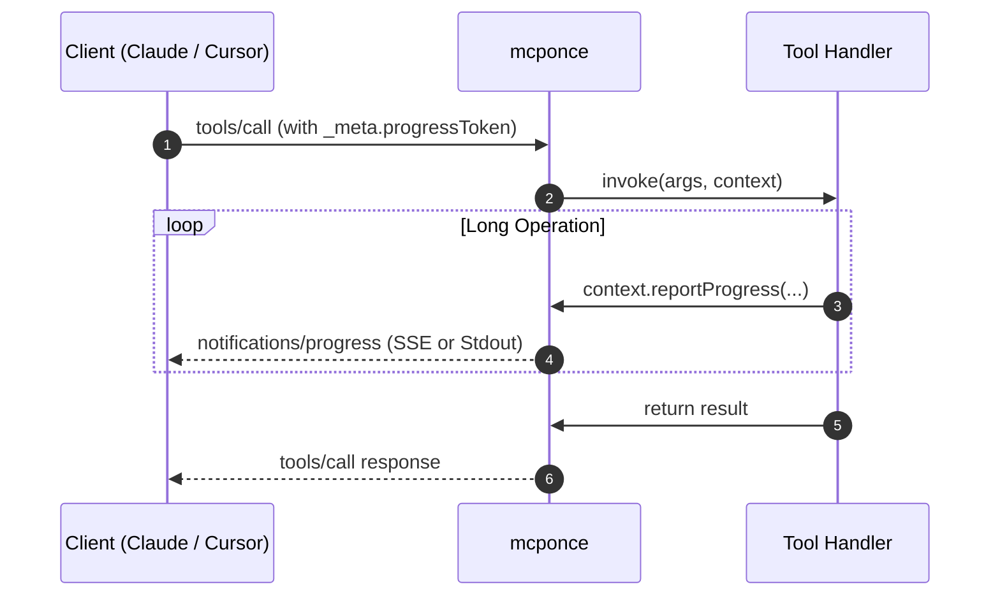

# Progress Reporting

Long-running tools—such as file downloads, batch imports, web scrapers, or AI video generation—need to notify clients about ongoing work. Without progress indicators, users and AI models may assume the server has timed out or hung.

**mcponce** has native, first-class support for the official **Model Context Protocol `notifications/progress` specification**, streaming live updates over Server-Sent Events (SSE), standard I/O, or programmatic callbacks.

---

## Reporting Progress from Tools

Every tool handler receives `context.reportProgress` (also available via `extra.reportProgress`). You can report progress using an object or positional arguments:

:::tabs group="progress-syntax"
::tab Object Syntax
```typescript
app.tool({
  name: 'batch_process_images',
  description: 'Processes a folder of images with resizing and compression',
  inputSchema: {
    count: { type: 'number', default: 10 }
  },
  handler: async ({ count }, context) => {
    for (let i = 1; i <= count; i++) {
      await processImage(i);

      // Report progress as an object
      await context.reportProgress({
        progress: i,
        total: count,
        message: `Processed image ${i} of ${count}`
      });
    }

    return { processed: count };
  }
});
```

::tab Positional Syntax
```typescript
app.tool({
  name: 'download_dataset',
  description: 'Downloads large dataset archives',
  handler: async (_, context) => {
    // Report progress using: (progress, total?, message?)
    await context.reportProgress(25, 100, 'Downloading chunk 1/4...');
    await sleep(500);

    await context.reportProgress(50, 100, 'Downloading chunk 2/4...');
    await sleep(500);

    await context.reportProgress(100, 100, 'Download complete!');
    return { success: true };
  }
});
```
:::

---

## How It Works Under the Hood



1. When a client like Claude Desktop or Cursor calls a tool, it can pass a `progressToken` inside `_meta`.
2. `mcponce` attaches this token to the tool context (`context.progressToken`).
3. Whenever `context.reportProgress(...)` is called, `mcponce` dispatches a standard `notifications/progress` JSON-RPC message out-of-band to the client.
4. If the client did not supply a progress token, calls to `reportProgress` are safely no-ops for MCP transports, but remain fully functional for internal subscribers and CLI callers.

---

## Programmatic Progress Listeners

When invoking tools programmatically via `app.callTool(...)` or `context.callTool(...)`, pass the `onProgress` callback:

```typescript
const result = await app.callTool('batch_process_images', { count: 50 }, {
  progressToken: 'job-12345',
  onProgress: (notification) => {
    console.log(
      `[${notification.tool}] ${notification.progress}/${notification.total} ` +
      `(${notification.message}) at ${notification.timestamp}`
    );
  }
});
```

---

## Interactive Terminal Progress in CLI

When testing your tools via the `mcponce call` CLI command, progress updates are automatically rendered as live, formatted terminal indicators:

```bash
npx mcponce call batch_process_images --count 5
```

```
[PROGRESS] 1/5 - Processed image 1 of 5
[PROGRESS] 2/5 - Processed image 2 of 5
[PROGRESS] 3/5 - Processed image 3 of 5
[PROGRESS] 4/5 - Processed image 4 of 5
[PROGRESS] 5/5 - Processed image 5 of 5
✔ Execution completed in 1.2s
{
  "processed": 5
}
```
