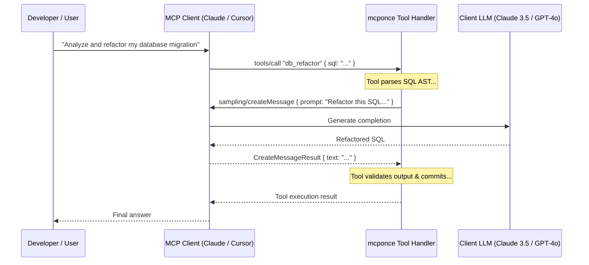
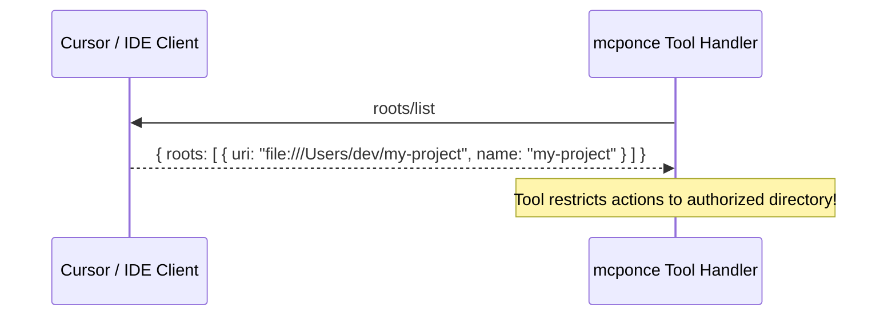

# MCP Sampling & Workspace Roots

Two of the most powerful features in the Model Context Protocol allow servers to query the client:
1. **MCP Sampling (`sampling/createMessage`)**: Allows an MCP tool to request an LLM completion *back* from the connected client (Claude Desktop, Cursor, AI agents). This effectively turns your tools into autonomous **sub-agents** that can generate code, summarize documents, parse unstructured logs, or classify data using the client's configured LLM.
2. **Workspace Roots (`roots/list`)**: Allows an MCP tool to discover the user's active project root directories open in their IDE, enabling safe, context-aware file system operations.

`mcponce` provides first-class, ergonomic support for both capabilities with automatic fallback handlers for offline testing and standalone CLI runs.

---

## 🧠 Part 1: MCP Sampling (`context.sample`)

### How Sampling Works

Traditional MCP interactions are one-way: the client calls a tool on the server. With **Sampling**, the server asks the client's LLM to generate a completion:



---

### Quick Example: Autonomous Sub-Agent Tool

Tools can call `sample()` directly from the handler context:

```typescript
import { createMcpServer } from 'mcponce';

const app = createMcpServer({
  name: 'code-assistant',
  version: '1.0.0'
});

app.tool({
  name: 'explain_code',
  description: 'Analyzes complex code and generates high-level architectural notes',
  inputSchema: {
    code: 'string',
    language: { type: 'string', default: 'typescript' }
  },
  handler: async ({ code, language }, { sample }) => {
    // Request an LLM completion from the connected client
    const response = await sample({
      prompt: `Analyze this ${language} code and provide 3 architectural insights:\n\n${code}`,
      systemPrompt: 'You are a staff software architect. Be concise and actionable.',
      maxTokens: 500,
      temperature: 0.3
    });

    // response.text contains the generated reply
    return {
      insights: response.text,
      modelUsed: response.model
    };
  }
});

app.run();
```

---

### Flexible Calling Signatures

`mcponce` supports both shorthand string prompts and full protocol options:

:::tabs group="sampling-styles"
::tab Shorthand String
```typescript
// 1. Simplest one-liner prompt (defaults to 1000 maxTokens)
const reply = await sample("What is the capital of France?");
console.log(reply.text); // "Paris"
console.log(String(reply)); // Also returns reply.text via toString()
```
::tab Options Object
```typescript
// 2. Parametric options with system prompt and temperature
const reply = await sample({
  prompt: "Extract all email addresses from this log text: ...",
  systemPrompt: "Output a JSON array of strings only.",
  maxTokens: 300,
  temperature: 0.1,
  modelPreferences: {
    intelligencePriority: 0.9,
    hints: [{ name: "claude-3-5-sonnet" }]
  }
});

// Automatic JSON parsing: if the output is JSON, reply.data is pre-parsed!
const emails: string[] = reply.data;
```
::tab Multi-Turn Chat
```typescript
// 3. Multi-turn conversation messages with mixed media
const reply = await sample({
  messages: [
    { role: 'user', content: 'Here is the current system error stack: ...' },
    { role: 'assistant', content: 'I identified a null pointer in service.ts.' },
    { role: 'user', content: 'How should we patch it?' }
  ],
  maxTokens: 1000
});
```
:::

---

### Programmatic & Standalone Sampling (`app.sample`)

You can also call sampling directly on the server instance:

```typescript
const result = await app.sample("Hello from server!");
console.log(result.text);
```

---

### Offline & Testing Fallback (`app.onSample`)

When running tests or using standalone CLI commands where no real AI client is connected, configure a fallback handler so your server never crashes:

```typescript
// 1. In configuration
const app = createMcpServer({
  name: 'my-server',
  onSample: async (params) => {
    // Mock response or forward to a local Ollama / OpenAI API
    return {
      role: 'assistant',
      text: `Mock answer for: ${params.messages[0].content.text}`,
      model: 'local-test-model'
    };
  }
});

// 2. Or dynamically at runtime
app.onSample(async (params) => {
  return "Custom mock response";
});
```

:::tip Clear Error Messages
If a tool attempts to call `sample()` when no client is connected and no fallback handler is configured, `mcponce` throws a clear, actionable error:
`Sampling is unavailable: No connected client session supporting sampling/createMessage is active, and no fallback handler was configured. To enable sampling during testing or standalone runs, register a handler with app.onSample((params) => ...).`
:::

---

## 📂 Part 2: Workspace Roots (`context.listRoots`)

### How Roots Work

In IDEs like **Cursor**, **VS Code**, or **Antigravity**, a user may have one or more project folders open in their workspace.

Through the MCP **Roots protocol** (`roots/list`), your server can ask the client for the list of open directories. This allows file-oriented tools (git managers, code searchers, linters) to operate safely within authorized boundaries.



---

### Accessing Roots in Tools

```typescript
app.tool({
  name: 'list_project_files',
  description: 'Discovers files inside the active workspace',
  handler: async (_args, { listRoots }) => {
    // 1. Query client workspace roots
    const roots = await listRoots();

    if (roots.length === 0) {
      return { warning: 'No active workspace folders found in client.' };
    }

    const mainRoot = roots[0];
    return {
      activeFolder: mainRoot.name,
      folderUri: mainRoot.uri
    };
  }
});
```

---

### Listening to Workspace Changes (`onRootsListChanged`)

When a developer opens or closes a project folder in Cursor or Claude Desktop, the client sends a `notifications/roots/list_changed` notification:

```typescript
app.onRootsListChanged((updatedRoots) => {
  console.log('User changed workspace directories:', updatedRoots);
  // Re-index project files or clear project caches
});
```

---

### Testing Roots Offline (`app.onListRoots`)

Just like sampling, provide a mock fallback for offline test suites:

```typescript
app.onListRoots(async () => [
  { uri: 'file:///tmp/mock-workspace', name: 'mock-workspace' }
]);
```

---

## 🛡️ Best Practices

1. **Token Budgets**: Always provide a sensible `maxTokens` (e.g. 200–1000) when requesting completions to keep client latency low.
2. **Defensive Parsing**: Use `reply.data` for automatic JSON extraction, or wrap custom string parsing in `try/catch`.
3. **Respect Client Signals**: `sample()` automatically inherits the tool's cancellation signal and timeout, aborting promptly if the user stops the execution.
4. **Offline Testing**: Always use `app.onSample()` in Vitest/Jest unit tests to avoid requiring live AI clients.
