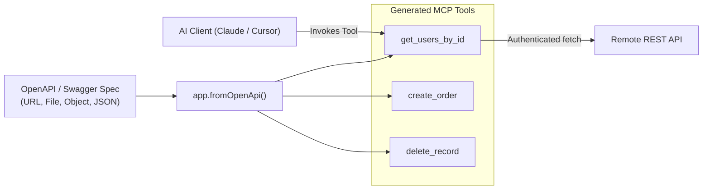

# OpenAPI & Swagger Tool Auto-Generation

Building MCP tools for existing backend services, microservices, or public REST APIs is often repetitive: writing schemas, parsing path variables, building query strings, handling JSON payloads, and mapping error codes.

**`mcponce`** eliminates this boilerplate with **`app.fromOpenApi()`** (and `createOpenApiTools()`). Point it to an OpenAPI 3.0, 3.1, or Swagger 2.0 specification, and `mcponce` automatically generates, validates, and registers type-safe MCP tools in seconds:



---

## 🚀 30-Second Quickstart

```typescript
import { createMcpServer } from 'mcponce';

const app = createMcpServer({ name: 'store-assistant' });

// Automatically register all endpoints from your backend's OpenAPI endpoint:
await app.fromOpenApi('https://petstore.swagger.io/v2/swagger.json', {
  headers: {
    'Authorization': `Bearer ${process.env.API_SECRET}`
  }
});

app.run();
```

Connected AI clients (Claude Desktop, Cursor, Antigravity) will instantly see all the API's endpoints as native MCP tools, complete with descriptions, input schemas, parameter documentation, and automatic HTTP execution!

---

## 📥 Spec Input Formats

`app.fromOpenApi()` accepts specifications in 4 formats:

:::tabs group="input-formats"
::tab Remote URL
```typescript
// Fetches live spec over HTTP/HTTPS
await app.fromOpenApi('http://localhost:8000/openapi.json');
```
::tab Local File Path
```typescript
// Reads local JSON file
await app.fromOpenApi('./specs/billing-api.json');
```
::tab In-Memory Object
```typescript
// Direct JS/TS object
await app.fromOpenApi({
  openapi: '3.0.0',
  info: { title: 'My API', version: '1.0' },
  paths: { ... }
});
```
::tab Raw JSON String
```typescript
// Raw JSON string
await app.fromOpenApi(jsonString);
```
:::

---

## ⚙️ Configuration & Filtering Options

You can fine-tune generated tools using `OpenApiOptions`:

```typescript
await app.fromOpenApi('http://localhost:8000/openapi.json', {
  // 1. Override the server URL defined in the spec
  baseUrl: 'https://staging-api.example.com/v1',

  // 2. Outbound HTTP Headers (static or dynamic callback)
  headers: {
    'X-API-Key': 'my-api-key',
    'User-Agent': 'mcponce-agent/1.0'
  },
  // Or dynamic per-request:
  // headers: async ({ operation, args }) => ({
  //   'Authorization': `Bearer ${await getTokenForUser(args.userId)}`
  // }),

  // 3. Filter endpoints by OpenAPI Tags
  tags: ['orders', 'users'], // Only endpoints tagged with 'orders' or 'users'

  // 4. Filter endpoints by include / exclude
  include: ['listOrders', 'createOrder'], // By operationId or path regex
  exclude: [/internal/i, /admin/i],

  // 5. In-Memory Response Caching (GET requests only)
  cache: { ttlMs: 60_000 },

  // 6. Concurrency / Mutex serialization
  sequential: 'backend_api', // Ensure requests don't exceed rate limits

  // 7. Request Timeout
  timeoutMs: 5000,

  // 8. Custom Tool Name Generator
  toolNameGenerator: (operation) => `api_${operation.method}_${operation.operationId}`
});
```

---

## 🎯 How Parameters Are Mapped

`mcponce` automatically resolves parameters into a unified, flat Zod input schema that LLMs understand effortlessly:

| OpenAPI Parameter | Location | How it is Handled |
| :--- | :--- | :--- |
| `in: "path"` | URL template (`/users/{userId}`) | Interpolated into URL with `encodeURIComponent` |
| `in: "query"` | Query string (`?role=admin&limit=10`) | Appended to URL via `URLSearchParams` |
| `in: "header"` | Request headers | Passed directly in outbound HTTP headers |
| `requestBody` (OAS 3) | Request body | Flattened top-level properties or JSON body payload |
| `in: "body"` (Swagger 2) | Request body | Serialized as JSON payload in POST/PUT/PATCH |

### Automatic Cancellation & Timeouts

If a user clicks **Stop** in Claude Desktop or Cursor, or if the request times out, `mcponce` immediately aborts the underlying `fetch()` via the tool handler's `signal` (`AbortSignal`), saving server bandwidth and preventing hanging sockets.

---

## 🛠️ Standalone Tool Generation (`createOpenApiTools`)

If you want to inspect or mutate generated tools before registering them:

```typescript
import { createOpenApiTools, createMcpServer } from 'mcponce';

const tools = await createOpenApiTools('./openapi.json', {
  baseUrl: 'https://api.mycorp.com'
});

console.log(`Generated ${tools.length} tools!`);

const app = createMcpServer('custom-server');
for (const tool of tools) {
  // Customize tool before registration if needed
  app.tool(tool);
}
```

---

## 📂 Bonus: Workspace Roots Utilities

For file-system and repository tools, `mcponce` provides workspace security utilities in `mcponce`:

```typescript
import { isPathInWorkspace, resolveWorkspacePath, findWorkspaceRoot } from 'mcponce';

app.tool({
  name: 'read_workspace_file',
  inputSchema: { relativePath: 'string' },
  handler: async ({ relativePath }, { listRoots }) => {
    const roots = await listRoots();

    // 1. Prevents directory traversal attacks (e.g. "../../etc/passwd")
    // Throws an error if relativePath escapes the workspace!
    const safePath = resolveWorkspacePath(roots, relativePath);

    // 2. Check if an arbitrary absolute path is permitted
    if (!isPathInWorkspace(roots, safePath)) {
      throw new Error('Access denied: Outside workspace roots');
    }

    const content = await fs.promises.readFile(safePath, 'utf8');
    return { content };
  }
});
```
