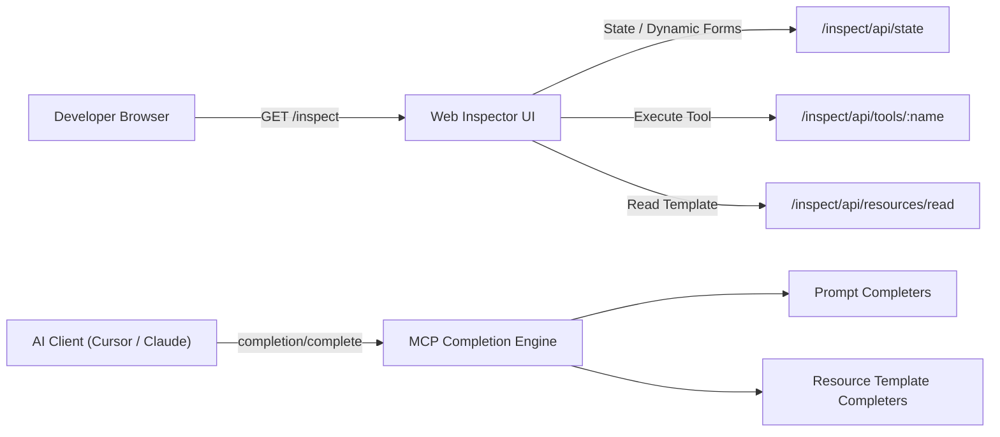

# Interactive Web Inspector & Autocomplete

`mcponce` bundles a built-in, zero-dependency **Interactive Web Inspector** and full support for the **MCP Autocompletion Protocol (`completion/complete`)**.

Developers can test tools via auto-generated forms, read static and dynamic resources, test prompt templates, observe live Prometheus metrics, and get real-time parameter suggestions directly in their browser or AI client (Cursor, Claude Desktop, Antigravity).



---

## 🌐 Launching the Web Inspector

### 1. From Server Code (`server.js inspect`)

When developing locally, launch the server in inspector mode with a single command:

:::tabs group="execution"
::tab From your script
```bash
node server.js inspect
```
::tab With TypeScript (tsx)
```bash
npx tsx server.ts inspect
```
::tab Don't auto-open browser
```bash
node server.js inspect --no-open
```
:::

The server starts, serves Streamable HTTP, and automatically opens the dashboard in your default browser:

```
✔ mcponce Web Inspector running at: http://localhost:3000/inspect
```

### 2. From Central CLI (`mcponce inspect`)

If you have servers already running in the background, open the Web Inspector for any active server by name:

```bash
# Open inspector for a specific running server
mcponce inspect my-server

# Or open the first running server in registry
mcponce inspect
```

### 3. Accessing via HTTP Directly

The Web Inspector is automatically mounted on every `mcponce` server at:

```
http://localhost:<port>/inspect
```

---

## 🎯 Key Inspector Features

### 1. Dynamic Form Generation & Tool Runner
- Automatically reflects parameters from `inputSchema` (`zod` or shorthand definitions).
- Generates tailored input controls: text fields, numeric steppers, boolean switches, and JSON textareas for structured objects and arrays.
- **Sample Value Filler**: Automatically populates default schema values for rapid testing.
- **Execution Diagnostics**: Displays execution status (`200 OK` or `Error`), response duration in milliseconds, and LRU cache status (`Cache HIT` vs `Cache MISS`).
- **Multi-Format Output Viewer**: Formatted JSON tree view, raw text output, and image previews for tools returning binary media.

### 2. Dynamic Resource & Template Browser
- Explore all registered static resources (`system://metrics`, `config://...`) and dynamic RFC 6570 templates (`users://{userId}/profile`).
- Input variables for parametric URI templates and test resource read handlers instantly.

### 3. Prompt Template Previewer
- Inspect registered prompts and their argument schemas.
- Provide sample arguments and render the generated multi-turn conversation messages.

### 4. Real-Time Telemetry & Metrics
- Live dashboard displaying total tool invocations, error counts, active client sessions, and average latency.
- Direct links to Prometheus scrape endpoints (`GET /metrics`) and structured JSON telemetry (`GET /analytics`).

---

## ⚡ MCP Autocomplete Protocol (`completion/complete`)

The official MCP specification defines `completion/complete` to allow AI clients and user interfaces to request argument autocompletions as users or agents type.

`mcponce` provides built-in support for prompt arguments, resource template variables, and tool parameters.

### 1. Prompt Argument Autocompletion

Attach a `complete` dictionary to your prompt definition:

```ts
app.prompt({
  name: "git_commit",
  description: "Generate conventional commit messages",
  argsSchema: {
    type: "string",
    scope: "string"
  },
  complete: {
    type: async (query) => {
      const types = ["feat", "fix", "docs", "style", "refactor", "perf", "test", "chore"];
      return types.filter((t) => t.startsWith(query));
    },
    scope: (query) => ["auth", "api", "database", "ui", "cli"].filter((s) => s.startsWith(query))
  },
  handler: ({ type, scope }) => ({
    messages: [
      { role: "user", content: { type: "text", text: `Create a ${type}(${scope || '*'}) commit.` } }
    ]
  })
});
```

### 2. Resource Template Autocompletion

Define autocomplete callbacks for dynamic variables in resource URI templates:

```ts
app.resourceTemplate({
  uriTemplate: "repos://{owner}/{repo}",
  description: "Browse repository files",
  complete: {
    owner: async (query) => {
      const owners = ["litepacks", "facebook", "microsoft", "google"];
      return owners.filter((o) => o.toLowerCase().startsWith(query.toLowerCase()));
    },
    repo: async (query, context) => {
      // Access previously selected template variables if provided
      const owner = context?.arguments?.owner;
      if (owner === "litepacks") {
        return ["mcponce", "unitup", "docboot"].filter((r) => r.startsWith(query));
      }
      return ["core", "docs", "examples"].filter((r) => r.startsWith(query));
    }
  },
  handler: async (uri, { owner, repo }) => {
    return { owner, repo, branch: "main" };
  }
});
```

### 3. Programmatic Autocomplete Invocation

You can test autocompletion programmatically in tests or internal tools using `app.complete()`:

```ts
const result = await app.complete(
  { type: "ref/prompt", name: "git_commit" },
  { name: "type", value: "fe" }
);

console.log(result.values); // ["feat"]
console.log(result.total);  // 1
```

---

## 🚀 Instant OpenAPI Runner (`mcponce openapi`)

Need to test an external API or Swagger spec without writing any code? Run the built-in OpenAPI CLI runner:

```bash
# From a remote URL
npx mcponce openapi https://petstore.swagger.io/v2/swagger.json --port 4000

# From a local file with custom tool prefix
npx mcponce openapi ./swagger.json --prefix petstore
```

This command:
1. Parses the OpenAPI or Swagger specification.
2. Auto-generates type-safe MCP tools for all operations.
3. Starts the Streamable HTTP server on the specified port.
4. Launches the interactive Web Inspector in your browser!

---

## 🔒 Security & Offline Support

- **100% Offline**: The Web Inspector is fully self-contained. It contains zero external CDN dependencies, external fonts, or analytics trackers.
- **Authentication Compatible**: If an `apiKey` or Bearer token is configured, the `/inspect` dashboard remains accessible, and you can authenticate requests by passing `?api_key=<token>` in the query parameters or request headers.
