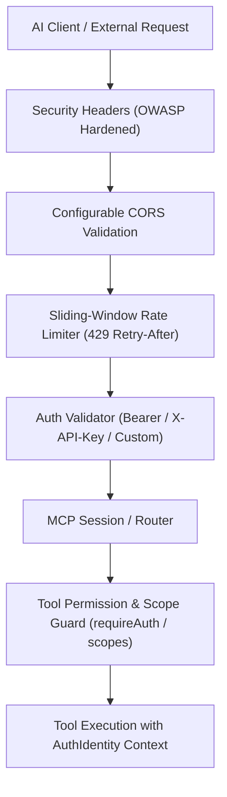

# Enterprise Security, Authentication & Rate Limiting

Deploying Model Context Protocol (MCP) servers in production or multi-tenant environments requires robust security protections. Exposing local or remote tools to network traffic without guardrails can lead to unauthorized execution, runaway LLM query loops, or Denial of Service (DoS).

**`mcponce`** provides a complete, turnkey security and identity layer built directly into the HTTP router:



---

## 🔒 1. Bearer Token & API Key Authentication

You can protect your MCP endpoints with static API keys or bearer tokens using single keys, key arrays, or environment variables.

### Basic Configuration

```typescript
import { createMcpServer } from 'mcponce';

const app = createMcpServer({
  name: 'secure-vault-server',
  apiKey: ['sk-live-alpha123', 'sk-live-beta456']
});
```

Clients can authenticate using either standard header:

```bash
# Authorization header with Bearer prefix
curl -X POST http://localhost:3000/mcp \
  -H "Authorization: Bearer sk-live-alpha123" \
  -H "Content-Type: application/json" \
  -d '{"jsonrpc":"2.0","id":1,"method":"tools/list"}'

# Or dedicated X-API-Key header
curl -X POST http://localhost:3000/mcp \
  -H "X-API-Key: sk-live-beta456" \
  -H "Content-Type: application/json" \
  -d '{"jsonrpc":"2.0","id":1,"method":"tools/list"}'
```

:::tip Automatic Health Check Bypass
Orchestration and load balancer health checks (`GET /health`) automatically bypass authentication so container runtimes (Kubernetes, AWS ECS, Docker) can verify liveness without credentials.
:::

### Environment Variable Support

If `apiKey` is not specified in code, `mcponce` automatically checks for comma-separated keys in standard environment variables:

```bash
export MCP_TOKEN="my-secret-key"
# or
export MCP_API_KEY="key1,key2,key3"
```

---

## 🛡️ 2. Custom Identity Validator (`auth.validate`)

For enterprise deployments requiring JWT signature verification, database session lookups, or Role-Based Access Control (RBAC), provide a custom asynchronous `auth.validate` callback:

```typescript
import { createMcpServer, type AuthIdentity } from 'mcponce';

const app = createMcpServer({
  name: 'enterprise-mcp-server',
  auth: {
    // Custom token validator
    validate: async (token, context): Promise<AuthIdentity | boolean> => {
      if (!token) return false;

      // Verify JWT or query database
      const user = await verifyJwtToken(token);
      if (!user) return false;

      // Return resolved identity with roles and permission scopes
      return {
        id: user.sub,
        user: user.email,
        role: user.isAdmin ? 'admin' : 'member',
        scopes: user.permissions // e.g. ['read', 'database:write']
      };
    },
    // Optional endpoints that bypass authentication
    excludedPaths: ['/info']
  }
});
```

When `validate` returns an `AuthIdentity` object:
1. The identity is attached to the request session.
2. The identity is passed down to all executed tools via `extra.auth` and `context.auth`.
3. Tool-level permission scopes are checked against `identity.scopes`.

---

## 🎯 3. Tool-Level Permissions & Scopes

Not all tools within an MCP server require the same privilege level. You can enforce authentication and fine-grained permission scopes on individual tools:

```typescript
app.tool({
  name: 'wipe_customer_data',
  description: 'Permanently deletes customer records',
  inputSchema: { customerId: 'string' },
  // Requires authenticated identity
  requireAuth: true,
  // Requires specific RBAC scopes
  scopes: ['admin:customers', 'write'],
  handler: async ({ customerId }, ctx, extra) => {
    // Access authenticated identity
    console.log(`Executed by: ${extra.auth?.user} (${extra.auth?.role})`);
    await db.customers.delete(customerId);
    return `Customer ${customerId} deleted`;
  }
});
```

### Scope Matching Rules

`mcponce` evaluates permission scopes using standard hierarchical rules:
- **Wildcard Match**: If the identity has scope `*` or `admin`, all tool scopes are granted.
- **Prefix Match**: Scope `database:*` grants `database:read`, `database:write`, etc.
- **Exact Match**: Scope `tools:call` matches `tools:call`.

If an unauthenticated client or a user lacking required scopes attempts to invoke the tool, `mcponce` rejects the invocation immediately with a descriptive error.

---

## ⏱️ 4. Sliding-Window Rate Limiting

LLM agents can accidentally trigger runaway loops or excessive API calls. `mcponce` includes a built-in, sliding-window rate limiter to protect your server:

```typescript
const app = createMcpServer({
  name: 'rate-limited-server',
  rateLimit: {
    max: 100,            // Maximum 100 requests
    windowMs: 60 * 1000  // Per 1-minute sliding window
  }
});
```

### Rate Limit Response Headers

`mcponce` automatically appends standard rate limiting headers to every HTTP response:

| Header | Description | Example |
| :--- | :--- | :--- |
| `X-RateLimit-Limit` | Maximum allowed requests per window | `100` |
| `X-RateLimit-Remaining` | Number of requests remaining in current window | `87` |
| `X-RateLimit-Reset` | Seconds until rate limit window resets | `42` |

When a client exceeds the limit:
- Returns HTTP status **`429 Too Many Requests`**.
- Sets `Retry-After: <seconds>` indicating how long to wait before retrying.
- Excludes `/health` probes to prevent container health check flap.

---

## 🌐 5. Configurable CORS & Security Headers

### Enterprise Security Headers

By default, `mcponce` injects hardened OWASP security headers into all responses:
- `X-Content-Type-Options: nosniff` (prevents MIME type sniffing)
- `X-Frame-Options: SAMEORIGIN` (guards against clickjacking)
- `Referrer-Policy: strict-origin-when-cross-origin` (prevents referrer leakage)
- `X-XSS-Protection: 1; mode=block` (browser XSS filtering)

### Custom CORS Configuration

When exposing MCP servers over HTTP/SSE for browser-based agents or frontends, configure custom origins and credentials:

```typescript
const app = createMcpServer({
  name: 'cors-protected-server',
  cors: {
    origin: ['https://app.example.com', 'https://staging.example.com'],
    credentials: true,
    allowHeaders: ['Content-Type', 'Authorization', 'X-API-Key', 'mcp-session-id'],
    exposeHeaders: ['mcp-session-id', 'mcp-protocol-version']
  }
});
```

You can also pass a dynamic origin callback:

```typescript
cors: {
  origin: (origin) => {
    return origin.endsWith('.internal.company.com');
  }
}
```

---

## 💻 6. CLI Testing with Protected Servers

When calling or inspecting tools on an auth-protected server via the `mcponce` CLI, pass `--token` or `--api-key`:

```bash
# Call tool on protected server
mcponce call my-server generate_report --date 2026-09-09 --token my-secret-key

# List tools with token
mcponce tools my-server --token my-secret-key
```

Or set the environment variable in your terminal session:

```bash
export MCP_TOKEN="my-secret-key"
mcponce call my-server generate_report --date 2026-09-09
```
