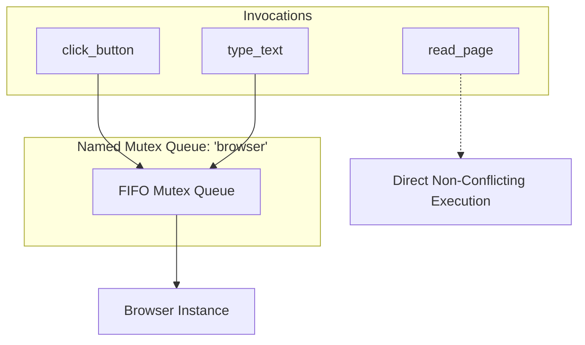

# Concurrency & Named Queues

When AI agents execute workflows, they often trigger parallel requests. In many real-world scenarios—such as browser automation, hardware interaction, shared database mutations, or rate-limited third-party APIs—concurrent executions lead to race conditions, locked tables, or inconsistent application states.

**mcponce** features a high-performance **FIFO Concurrency Engine** capable of handling over **1,800,000 queue operations per second** with negligible overhead.



---

## 1. Named Mutex Queues (Cross-Tool Synchronization)

The most common concurrency problem in MCP is synchronizing different tools that manipulate the same underlying resource. 

By setting `sequential: "name"`, tools sharing the same string key are serialized in a dedicated FIFO queue without blocking unrelated tools:

```typescript
import { createMcpServer } from 'mcponce';

const app = createMcpServer({ name: 'browser-automation' });

// All tools targeting 'browser' will run one-by-one in FIFO order
app.tool({
  name: 'browser_navigate',
  sequential: 'browser',
  handler: async ({ url }) => {
    return page.goto(url);
  }
});

app.tool({
  name: 'browser_click',
  sequential: 'browser',
  handler: async ({ selector }) => {
    return page.click(selector);
  }
});

app.tool({
  name: 'browser_type',
  sequential: 'browser',
  handler: async ({ selector, text }) => {
    return page.fill(selector, text);
  }
});

// Unrelated tools run concurrently without delay
app.tool({
  name: 'calculate_checksum',
  handler: async ({ data }) => crypto.createHash('sha256').update(data).digest('hex')
});
```

---

## 2. Tool-Level Concurrency

You can also control concurrency per individual tool:

:::tabs group="tool-concurrency"
::tab Single-Tool Sequential (`sequential: true`)
```typescript
app.tool({
  name: 'write_audit_log',
  description: 'Appends to disk file sequentially',
  // Ensures this specific tool never runs multiple invocations in parallel
  sequential: true, 
  handler: async ({ message }) => {
    await fs.promises.appendFile('/var/log/audit.log', message + '\n');
  }
});
```

::tab Tool Concurrency Cap (`maxConcurrency`)
```typescript
app.tool({
  name: 'fetch_stock_quote',
  description: 'Limited to at most 3 simultaneous API calls',
  maxConcurrency: 3,
  handler: async ({ symbol }) => {
    return fetchQuote(symbol);
  }
});
```
:::

---

## 3. Server-Level Concurrency

If your entire server interacts with a single exclusive resource (such as a local database file or connected USB device), you can enforce concurrency rules globally:

:::tabs group="server-concurrency"
::tab Strict Sequential (`sequential: true`)
```typescript
const app = createMcpServer({
  name: 'sqlite-manager',
  // Entire server executes strictly one tool at a time (FIFO)
  sequential: true 
});
```

::tab Global Concurrency Cap (`maxConcurrency`)
```typescript
const app = createMcpServer({
  name: 'scraping-service',
  // Allow at most 10 concurrent tool executions across all tools
  maxConcurrency: 10 
});
```
:::

---

## 4. Programmatic Invocation Overrides

When calling tools programmatically via `app.callTool(...)` or `context.callTool(...)`, you can override or specify queueing behavior dynamically:

```typescript
// Enforce sequential execution on the 'database' queue for this specific call
await app.callTool('run_migration', { step: 1 }, {
  sequential: 'database'
});
```

---

## Performance Characteristics

In high-throughput stress testing with 50,000 queued items across 20 concurrent workers:
- **Throughput:** ~1,850,000 operations / sec
- **Allocation overhead:** < 80 bytes per queued promise
- **Fairness:** Guaranteed FIFO order execution with zero starvation
