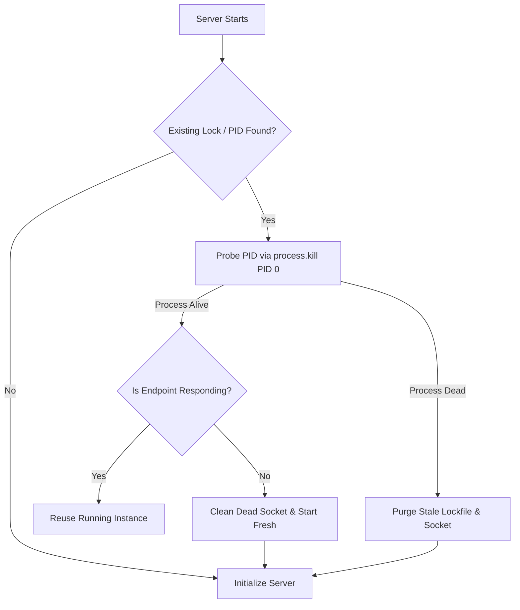

# Crash Recovery & Lifecycle

MCP servers deployed locally or in production containers face ungraceful restarts, system reboots, and sudden terminations (`SIGKILL`). If an old process dies without cleaning up its lockfiles or listening sockets, subsequent restarts fail with `EADDRINUSE` or false "already running" errors.

**mcponce** has built-in **self-healing lifecycle mechanics** that detect stale locks, clean up orphaned resources, and guarantee zero-downtime recovery.

---

## 1. Stale PID Detection & Socket Cleanup

Whenever `mcponce` starts, it inspects existing runtime descriptors in `~/.mcponce`:



1. **Active Process Probe:** `mcponce` verifies if the recorded PID is genuinely alive in the OS process table.
2. **Stale Recovery:** If the PID no longer exists, `mcponce` automatically logs a warning, unlinks the orphaned lockfile and socket, and proceeds to boot cleanly.
3. **Preventing `EADDRINUSE`:** You never need to manually run `kill -9` or delete `.sock` files after a machine crash.

---

## 2. Graceful Shutdown Traps

`mcponce` registers signal handlers for `SIGINT` (Ctrl+C), `SIGTERM` (Docker / Kubernetes stop), and `SIGHUP`:

```typescript
// Controlled programmatic shutdown
await app.stop();
```

When a shutdown signal is received:
1. **Stop Accepting New Invocations:** The HTTP and SSE endpoints reject incoming requests with service unavailable messages.
2. **Drain Active Invocations:** In-flight tool executions are allowed up to a graceful drain grace period to finish work.
3. **Abort Signals Dispatched:** Remaining tasks receive `context.signal.abort()`.
4. **Clean up Resources:** Sockets are unlinked, telemetry metrics flushed to disk, and the process exits cleanly with code `0`.

---

## 3. Single-Instance Coordination

To prevent conflicting server instances from corrupting shared databases or state:
- Each server registers with a unique name in `~/.mcponce/servers.json`.
- If an instance is already running healthy, subsequent CLI commands (`mcponce start`, `mcponce call`) automatically route to the running instance rather than spawning a duplicate listener.

:::tip Disabling Single-Instance Mode
If you explicitly want to test multiple independent instances of the same server simultaneously (e.g., in integration tests), pass `--no-singleton`:
```bash
node server.js --no-singleton --port 4001
```
:::
