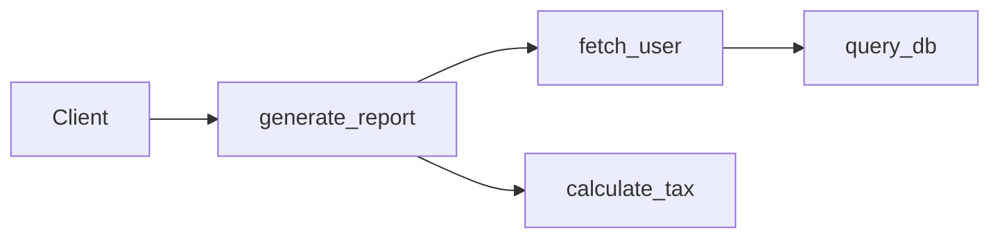

# Telemetry & Analytics

Production-grade AI applications require complete visibility into which tools are being triggered, execution durations, failure rates, and dependencies between tools.

**mcponce** has an integrated, zero-dependency telemetry engine that continuously monitors all tool executions with minimal CPU and memory overhead.

---

## Accessing Analytics

Analytics are accessible in three distinct ways:

:::tabs group="analytics-access"
::tab Programmatic API
```typescript
import { createMcpServer } from 'mcponce';

const app = createMcpServer({ name: 'analytics-demo' });

// Retrieve the snapshot object
const analytics = app.getAnalytics();
console.log('Total calls:', analytics.summary.totalInvocations);
console.log('Average duration:', analytics.summary.averageExecutionTimeMs, 'ms');
```

::tab HTTP Endpoint (`GET /analytics`)
```bash
# Query the live running server
curl http://localhost:3000/analytics
```

::tab MCP System Resource (`system://analytics`)
AI clients can read live server performance directly via MCP's resource protocol at:
```
system://analytics
```
:::

---

## Analytics Data Structure

The returned `ServerAnalytics` object contains a high-level summary, per-tool metrics, inter-tool call relationships, and a circular buffer of recent invocations:

```json
{
  "startedAt": "2026-09-09T10:00:00.000Z",
  "generatedAt": "2026-09-09T10:15:30.123Z",
  "summary": {
    "totalInvocations": 1420,
    "successfulInvocations": 1395,
    "failedInvocations": 20,
    "timeoutInvocations": 3,
    "cancelledInvocations": 2,
    "cachedInvocations": 412,
    "totalRetries": 15,
    "totalExecutionTimeMs": 84210,
    "averageExecutionTimeMs": 59.3,
    "totalInterToolCalls": 320
  },
  "tools": {
    "fetch_user": {
      "name": "fetch_user",
      "invocations": 650,
      "successes": 648,
      "failures": 2,
      "timeouts": 0,
      "cancellations": 0,
      "cacheHits": 240,
      "retries": 1,
      "avgDurationMs": 14.2,
      "minDurationMs": 0.8,
      "maxDurationMs": 182.4,
      "lastDurationMs": 1.2,
      "lastInvokedAt": "2026-09-09T10:15:28.000Z",
      "callers": { "client": 400, "generate_report": 250 },
      "invokedTools": { "query_database": 650 }
    }
  },
  "interToolCalls": [
    { "caller": "generate_report", "target": "fetch_user", "count": 250 }
  ],
  "recentInvocations": [
    {
      "id": 1420,
      "tool": "fetch_user",
      "caller": "generate_report",
      "durationMs": 1.2,
      "status": "success",
      "isCacheHit": true,
      "timestamp": "2026-09-09T10:15:28.000Z"
    }
  ]
}
```

---

## Inter-Tool Call Graphs

When tools call other tools via `context.callTool(...)`, `mcponce` tracks the relationship automatically in `interToolCalls`:



This telemetry lets you visualize call graphs, discover performance bottlenecks, and inspect how complex compound tasks break down across your tool ecosystem.
