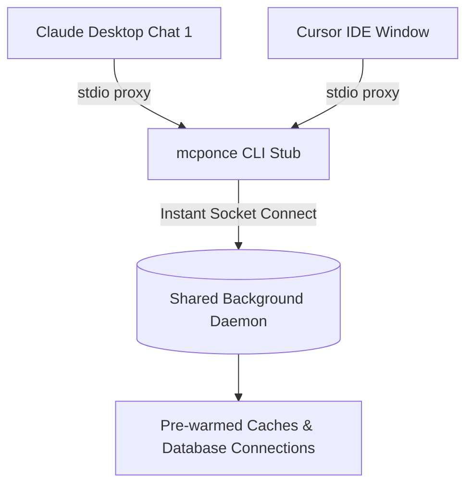

# Unitup Background Daemon

When running MCP servers via standard desktop configurations (Claude Desktop, Cursor, Zed), the AI client spawns a brand-new Node.js process every time a conversation starts or the client reloads. For servers with heavy dependencies (Playwright, Prisma, TensorFlow, large schemas), this causes:
- 1-3 second cold-start delays.
- Multiple duplicate server instances eating machine RAM.
- Broken in-memory state and caches across chat sessions.

**mcponce** solves this with the `--background` mode, powered by the **Unitup daemon architecture**.



---

## Enabling Background Mode

You can enable background mode in your server configuration or via command-line flags:

:::tabs group="background-modes"
::tab Configuration Option
```typescript
const app = createMcpServer({
  name: 'my-agent',
  background: true // Run as detached daemon
});
```

::tab CLI Flag
```bash
# Claude desktop config or command line
node server.js --background
```
:::

---

## How It Works

1. **Instant Handshake:** When Claude or Cursor launches `node server.js --background`, the lightweight stub process checks `~/.mcponce/servers.json`.
2. **Daemon Reuse:** If the daemon process is already running and healthy, the stub immediately connects over a local Unix domain socket / named pipe. Cold start time drops to **< 5 milliseconds**.
3. **Automatic Forking:** If the daemon is not running, the stub spawns a detached background process, registers its PID and socket path, and bridges standard I/O seamlessly.
4. **Shared State:** All chat conversations, windows, and CLI callers share the same pre-warmed cache, rate limiters, and database connection pools.

---

## Daemon Lifecycle Commands

Manage background daemons directly from the terminal using the `mcponce` CLI:

:::tabs group="daemon-cli"
::tab View Running Daemons
```bash
npx mcponce list
```
Displays registered servers, their PIDs, uptime, socket paths, and health status.

::tab Stop a Daemon
```bash
npx mcponce stop my-agent
```
Sends a graceful shutdown signal to the daemon and cleans up all sockets and locks.

::tab Restart a Daemon
```bash
npx mcponce restart my-agent
```
Performs a zero-downtime hot reload of the background worker.
:::
