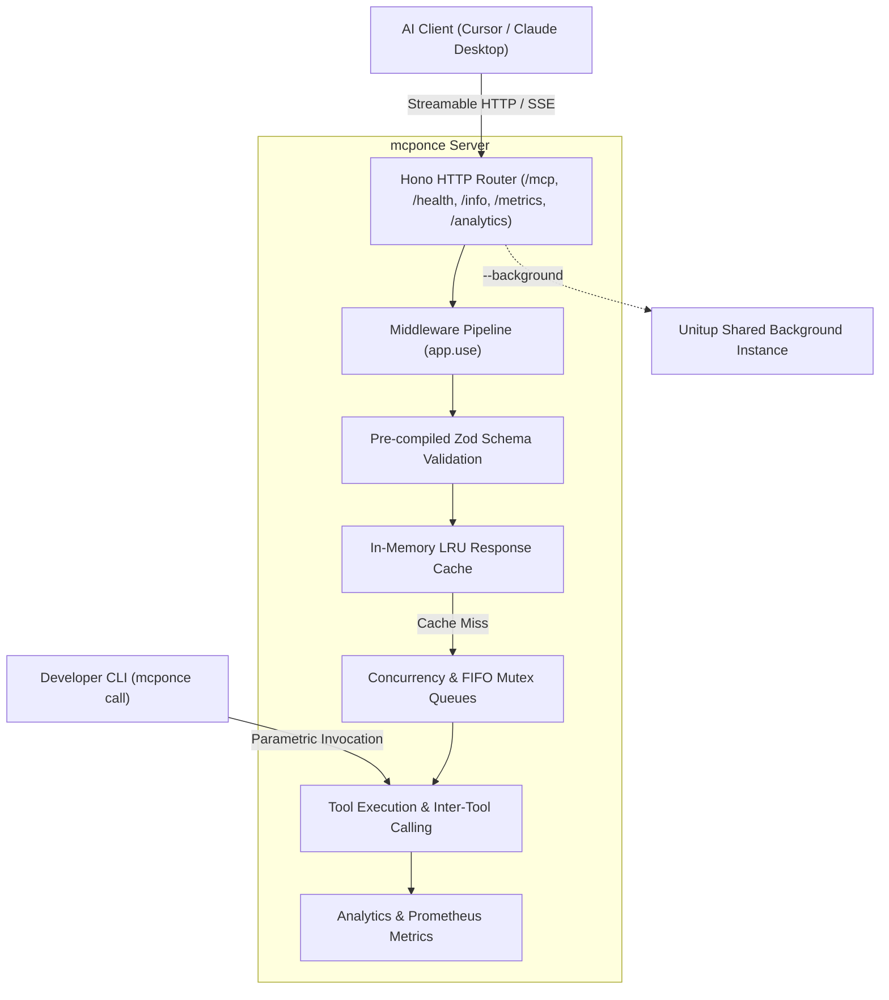

# mcponce

> **Cross-platform, single-executable Model Context Protocol (MCP) server framework** powered by Hono and the official Model Context Protocol TypeScript SDK.

```bash
npm install mcponce
```

---

## ⚡ Overview

**`mcponce`** simplifies building, testing, deploying, and observing production-grade MCP servers for LLM agents (Claude Desktop, Cursor, Antigravity, custom AI workflows).

Unlike raw SDK setups that require managing subprocess lifecycles, setting up custom HTTP routers, or creating separate proxy daemons, `mcponce` packages **everything into a single runnable file**:



---

## 🚀 30-Second Quickstart

Create a file named `server.ts` (or `server.js`):

```ts
import { createMcpServer } from 'mcponce';

// Initialize server instance
const app = createMcpServer({
  name: 'my-assistant-tools',
  version: '1.0.0'
});

// Register a type-safe tool
app.tool({
  name: 'calculate_mortgage',
  description: 'Calculates monthly mortgage payments based on loan amount and interest',
  inputSchema: {
    principal: 'number',
    annualRatePercent: { type: 'number', default: 6.5 },
    years: { type: 'number', default: 30 }
  },
  cache: { ttlMs: 60_000 },
  handler: ({ principal, annualRatePercent, years }) => {
    const monthlyRate = annualRatePercent / 100 / 12;
    const totalMonths = years * 12;
    const monthlyPayment =
      (principal * monthlyRate) / (1 - Math.pow(1 + monthlyRate, -totalMonths));

    return {
      monthlyPayment: Math.round(monthlyPayment * 100) / 100,
      totalPayment: Math.round(monthlyPayment * totalMonths * 100) / 100
    };
  }
});

// Start listening or coordinate background daemon
app.run();
```

:::tabs group="execution"
::tab Run directly with Node
```bash
node server.js
```
::tab Run with TypeScript (tsx)
```bash
npx tsx server.ts
```
::tab Test via built-in CLI
```bash
npx mcponce call calculate_mortgage --principal 300000 --years 15
```
:::

---

## 🌟 Key Capabilities

:::tip Zero-Allocation Validation & Sub-Microsecond Execution
`mcponce` pre-compiles Zod validation schemas upon registration. Core mutex queues and argument coercers operate at **1,800,000+ ops/sec**, while hot cache hits achieve **5,500+ ops/sec** with sub-millisecond p99 latency.
:::

- **Single-Executable Architecture**: Everything in one file. Run directly or package with Bun/pkg/SEA.
- **Universal Background Service**: Pass `--background` (or `-b`) to coordinate a background daemon powered by [Unitup](https://github.com/litepacks/unitup). Multiple local client windows automatically share a single server process without port collisions.
- **Inter-Tool Invocations**: Call tools within tools (`context.callTool`) with cycle detection and stack traces.
- **In-Memory Response Caching**: Hot LRU responses with customizable TTL and deterministic argument hashing.
- **Smart Input Coercion**: Automatically coerces stringified numbers, booleans, and JSON objects sent by LLMs or CLI flags.
- **Dynamic Resource Templates**: RFC 6570 parametric URI templates (`users://{userId}/profile`) with automated variable extraction, autocomplete handlers, and return normalization.
- **Resource Subscriptions & Live Push**: Client subscriptions (`resources/subscribe`, `resources/unsubscribe`) with live push updates (`app.notifyResourceUpdated`, `app.notifyResourceListChanged`).
- **Enterprise Security & Rate Limiting**: Multi-key Bearer/API Key auth, custom identity validators (`auth.validate`), tool-level RBAC scopes, sliding-window rate limiting (429 Retry-After), and OWASP security headers.
- **MCP Sampling & Workspace Roots**: Turn tools into autonomous sub-agents by requesting LLM completions back from the client (`context.sample`) and discovering open project directories (`context.listRoots`).
- **OpenAPI & Swagger Tool Generation**: Auto-generate type-safe MCP tools from any OpenAPI 3 or Swagger 2 spec with `app.fromOpenApi()`.
- **Interactive Web Inspector & Autocomplete**: Zero-dependency browser playground at `/inspect` (`mcponce inspect` / `server.js inspect`) with live form execution and official MCP `completion/complete` support.
- **Images & Binary Media**: Return raw `Buffer`s or use `image(buffer)` helpers with automatic magic byte MIME detection and base64 encoding.
- **Onion Middlewares**: Express/Koa-style middleware chain (`app.use`) for auth, tracing, and enrichment.
- **Real-Time Progress**: Native `context.reportProgress` streaming back to Claude Desktop and Cursor.
- **Full Observability**: Built-in `GET /analytics`, Prometheus `GET /metrics`, `system://metrics` MCP resource, and daily rotating logs.
- **CLI Parametric Caller**: Test tools from your terminal: `mcponce call <tool> --key=value`.

---

## 📚 Documentation Sections

| Section | Description |
| :--- | :--- |
| **[Getting Started](/getting-started/introduction)** | Core architecture, installation, quickstart, client configuration, and [Comparison & Alternatives](/getting-started/comparison). |
| **[Core Features](/core-features/defining-tools)** | Defining tools, [Resource Templates](/core-features/resource-templates), [Images & Media](/core-features/images-and-media), [Subscriptions & Push](/core-features/subscriptions-and-auth), [Security & Rate Limiting](/core-features/security-and-auth), [Sampling & Roots](/core-features/sampling-and-roots), [OpenAPI Generator](/core-features/openapi-tool-generation), [Web Inspector & Autocomplete](/core-features/web-inspector), shorthand schemas, inter-tool calling, input coercion, caching, and middleware. |
| **[Reliability & Safety](/reliability/concurrency-and-queues)** | Concurrency limits, mutex queues, cancellation, timeouts, retries, and crash recovery. |
| **[Observability & Metrics](/observability/telemetry-and-analytics)** | Built-in analytics, Prometheus scraping, call graphs, and log management. |
| **[Runtime & Transport](/runtime-and-cli/streamable-http)** | Streamable HTTP transport, Unitup background daemon, [Client Auto-Installer](/runtime-and-cli/client-auto-installer), CLI caller, and benchmark results. |
| **[API Reference](/api-reference/create-mcp-server)** | Full programmatic API reference for `createMcpServer`, `McpApp`, and TypeScript types. |
